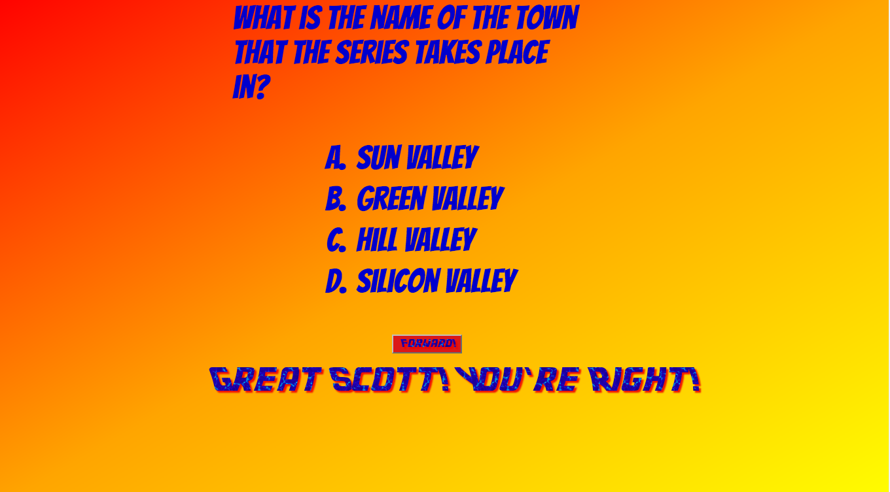
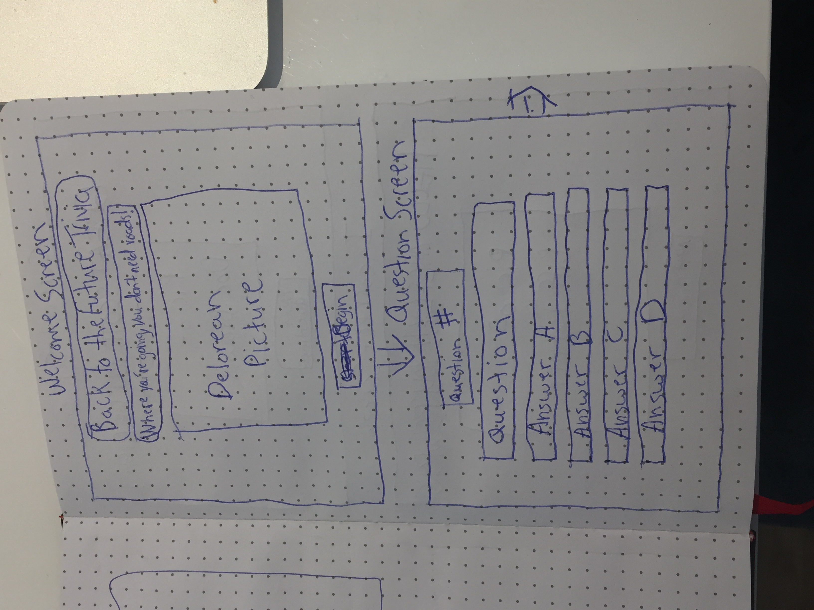

# Back-To-The-Future-Trivia
20 Questions of Back To The Future Trivia from all 3 films.

## Back to The Future Trivia
### Screenshots



### Wireframes


## What is Back To The Future Trivia?

The title is fairly self-explanatory: create a trivia game consisting of
20 multiple choice questions of varying difficulty from all three films 
in the Back to the Future trilogy. I chose to make this game because I am 
a massive movie geek, I love these films, and my GA WDI cohort is 
called 'DeLorean.' I wanted to pay tribute by creating a game that 
combined my passion for film with this course.

### How to Play Back To The Future Trivia

Click the 'Start Button' on the title screen. This will take you to the
first question screen. Click on the text of the answer you want. After the
custom message showing whether your answer was correct or not, click the
'forward button' to move on to the next question. Repeat these steps for
each question until the final one. At that point, a 'See Results' button
will appear. Click on that button to see your final score. A button saying
'Go Back to the Future' which also appear, which will allow you to restart
the game when clicked. Your score will return to zero and you can try 
and do better the next time!

## Technical Discussion

For this project, I used CSS, Javascript (namely a whole lot of jQuery),
and HTML (mainly just to link my CSS and Javasript files). I created my
title and question screens entirely through DOM manipulation. I created
11 separate functions within one large jQuery function.

## Notes on Game Structure

### Code sample below
```
//tracks and stores all correct clicked answers
function correctAnswers () {
  let txt = $(this).text();
  console.log(txt);
  let a = questionCounter;
      if (txt === questions[a].correctAnswer) {
        console.log(score);
        score++;
        let $greatScott = $('')
        $('#answer-display').html($greatScott);
      } else {
        let $helloMcfly = $('')
        $('#answer-display').html($helloMcfly);
      }

    //enables "forward" button to click to next question
    $('#next').prop('disabled', false);

      if (a === 19) {
//create "see results" button on the last question screen set event
//listener so that when "see results" button is clicked, clickResults function runs
        let $nextButton = $('#next');
        $nextButton.html('');
        $nextButton.off('click', nextQuestion);
        $nextButton.click(clickResults);
        $nextButton.attr('id', 'result-button');
      }
  };
  ```
  This function contains the biggest challenge I had to overcome in my game.
  I was able to cycle through the questions fairly easily unitl I got to
  the final one. I spent hours trying to figure out why I couldn't make
  my if statement work with 'questions.length,' but as soon as I brute
  forced it and just made the question counter equal to the last index
  in my questions array, everything worked like a charm and I was able to
  end the game. I also had difficulty restarting the game each time I
  ended it, and eventually just decided that instead of having the HTML
  for my title page in my index.html file,  I had to generate my entire game
  in the DOM to make it work more easily. Instead of clearing the screen
  at the end, I finally came to the conclusion (with some advice) to use 
  'location.reload' and as soon as I did that and it worked, I got frustrated 
  because I had spent so much time trying to figure out other solutions 
  that weren't working. To find the solution was really that simple was 
  humbling to be sure.

## The Making of Back To The Future Trivia

The first thing I did was create my array of questions, which was a lot 
of fun to do and where most of my creativity came through. The next step
was getting my game to clear the title screen when I clicked the start 
button to set up the question screen, and to cycle through all the questions
in my array in order. This was themost crucial step in creating my game 
and while challenging, was less difficult than getting the game to stop 
and restart. I didn't add the score counter until the end, even though 
that's a huge part of trivia, but I felt it was important to be able to 
cycle through my questions before I figured out some of the more 
idiosyncratic aspects of my game such as disabling the 'Forward' button 
until the user clicked on an answer. I detailed my biggest challenges in 
the making of my game in the above section.

## Any credits or notes I should add
Got the idea of how to build my questions array from this codepen:

https://codepen.io/gcarino/pen/LDgtn

The feedback from my regular study group was invaluable in terms of 
helping me talk through my logic and get it down in workable code form.
They also were able to point out the seemingly infinite silly syntax 
errors I would inevitably make. Major props to Alex, Dan, Jason, Philip, 
and Ryan for all of that help.

## Opportunities for Future Growth

From now on, in CSS, I will exclusively use percentages instead of pixels 
to size everything. It would've made doing a media query a LOT easier 
and I didn't even think about it until it was too late. 
That was definitely a huge learning experience for me.

## If you had more time to work on your game, what would you do?

Honestly, I'm amazed I got my game to work as well as it does, so there
really isn't too much more I was dying to do with it. I might have made
some fancier design elements if I had more time like insert BTTF music
or maybe bolts of lightning, but beyond those fun but ultimately unnecessary 
cosmetic tweaks, I'm happy with the functionality of my game.
