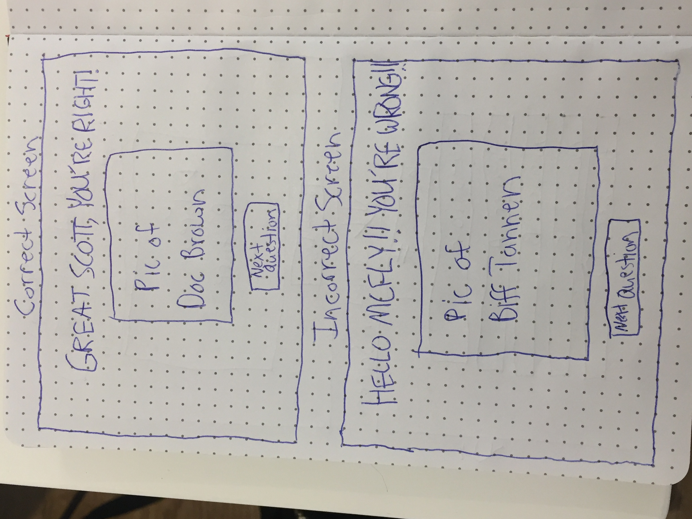
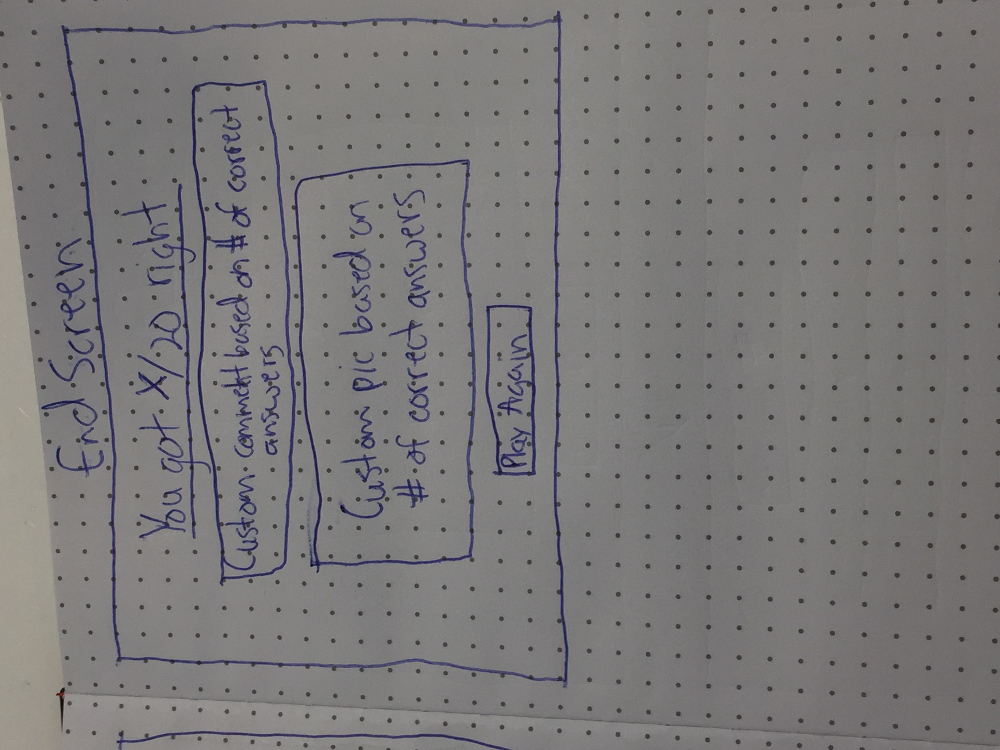

*** Jake Meltzer / 7/11/2017 ***

# Back to the Future Trivia Proposal

## What is Back to the Future Trivia?

The title is fairly self-explanatory: create a trivia game consisting of 20 multiple choice questions of varying difficulty from all three films in the Back to the Future trilogy. I'm choosing to make it because I am a massive movie geek, I love these films, and since my GA WDI cohort is called 'DeLorean,' I wanted to pay tribute by creating a game that combined my passion for film with this course.
## Wireframe
Apologies for the sideways pictures

## Initial thoughts on game structure

The key element of logic I need to figure to make the majority of the game run smoothly is after a player answers a question, make the screen change to the next screen with the next question. 

Depending on whether a player answers a questions correctly or not, I want to have an interlude screen with either "Great Scott, That's Right!" and a picture of an enthusiastic Doc Brown when you choose a correct answer, or "HELLO MCFLY??? YOU'RE WRONG!" with a particularly mean picture of Biff Tannen when you answer incorrectly and the correct answer underneath.

Another challenge I expect to face is counting correct and incorrect answers and submitting an output after a players answers all 20 questions. This output would appear on a screen after you answer every question. 

I also want to make it so that if a player answers, for example, between 17 and 20 questions right, a picture of a character will come up with an encouraging comment. I want to set the tiers for every 4 questions, so if you answer 0-4 questions right, 5-8, 9-12, 13-16, and 17-20, a different screen will pop up with different picture and text. 

I also am scared of figuring out how to start the game over again. I struggled mightily with that in tic-tac-toe, so I have to figure out how to do that here.

## Phases of Completion

### Phase 0-Beginning the game
-Upon page load, have game title appear at top of page with a subheading of "Where you're going, you don't need roads. Just knowledge." Picture of the Delorean should be underneath the subheading, and at the bottom of the screen, have a button that's labeled "Start Game" or "Begin Game."
-Add an event listener so that when the Start button is clicked, the title page is cleared and the screen with the first question and four corresponding possible answers appears.
### Phase 1-Cycle through questions
-Create an array of all twenty questions nested in separate objects with the keys being the question itself, the correct answer, and all the answers.
-On the question screen, display the question at the top of the screen. The letters A, B, C, and D should be displayed block-style in divs/spans and next to each letter should be one of the four possible answers, each in its own div/span.
-Create event listeners for each box where when a box with an answer is clicked, the page will change to the Doc page if it's the correct answer or the Biff page when it's an incorrect answer.
### Phase 2-Display correct and incorrect screens
-After players picks an answer, the corresponding page should have a button and an event listener should be created where when that button is clicked, the "correct" or "incorrect" screen will clear and the screen with the next question in the sequence will appear.
-Make correct and incorrect screens conditionals and then loop through them twenty times to match the questions loop.
-Count number of correct and incorrect answers through the loop of questions. If player clicks correct answer, store that in correct answers array. If player clicks incorrect answer, store that in incorrect answers array. 
### Phase 3-Ending Game, Tallying Score, and Restart
-The preceding sequence of "question page, click, answer page, click, question page" should be looped through twenty times for each question object in the questions array.
-On the last correct/incorrect screen, when the button is clicked, instead of going to another question screen, the ending screen should be displayed.
-Add the number of correct and incorrect answers, then add those numbers to create a score out of 20.
-Ending screen should display this score.
-Create a condition based on what the player's score is based on tiers of 4 (see 4th paragraph in "Initial Thoughts" section) where if the player's score falls within one of those tiers, the end screen will display a different image and phrase either praising or admonishing them for their performance in the game.
-Create a function that will allow the question loop to go back to the beginning of the questions array and start the loop over.
-This event will happen when the player clicks on a "Play Again" button.
### Phase 4-Styling the Game
-Create title of game on title screen using custom BTTF font.
-create fade in, fade out animation to transition between each page.
-Style each page with colors from the film's font and poster. 
-Each div/span that holds the question colored silver like the Delorean.
-Each div/span for answers will be colored lighter blue to match Marty's jeans (colors not final choices).
-Each encouraging/discouraging phrase for correct/incorrect pages styled in BTTF font.
-On final screen, same animation to transition between questions.

## Links and Resources

Thinking about using the .toggle jQuery function to toggle through the different screens I want to display, whether it's just toggle or toggleClass.
### toggleClass page on jQuery API
http://api.jquery.com/toggleClass/
### Code pen for a basic quiz made with JS
https://codepen.io/gcarino/pen/LDgtn
### Code pen for basic quiz made with jQuery
http://jsfiddle.net/anthkris/3fnzdnun/
### Walkthrough of how to make a simple JS quiz
https://www.sitepoint.com/simple-javascript-quiz/
